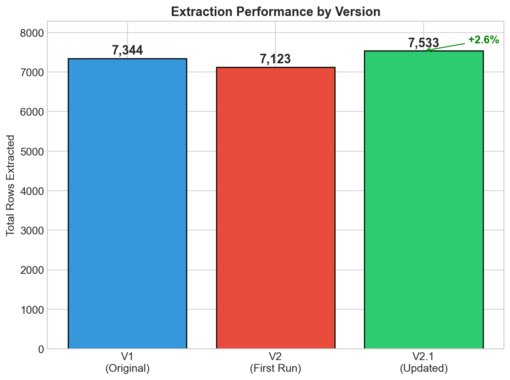
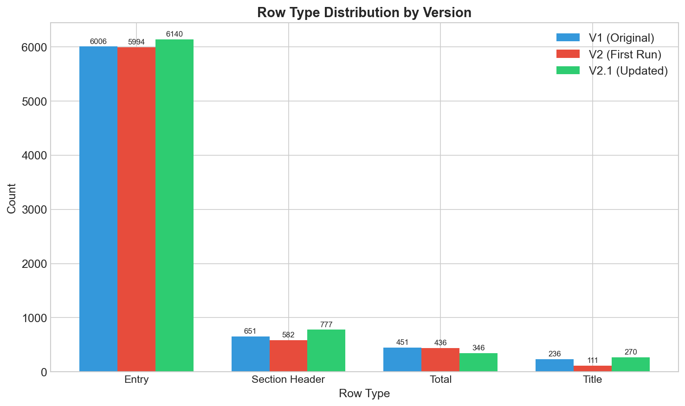
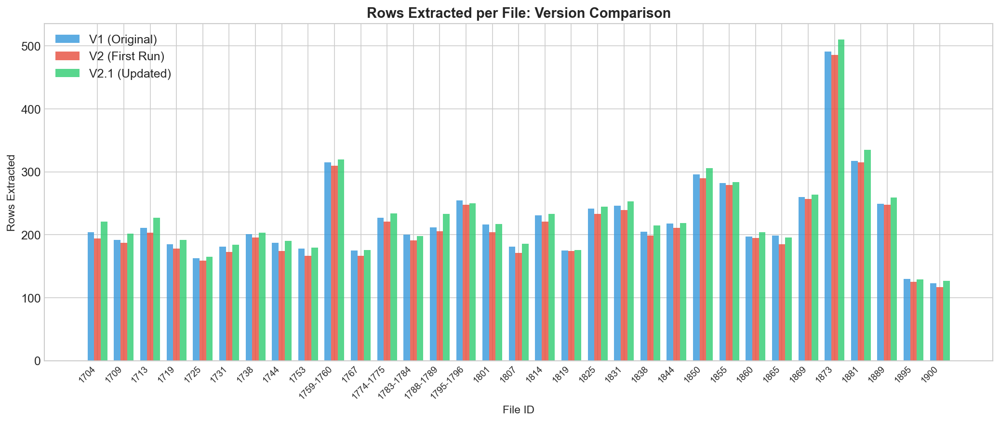

# Historical Ledger OCR Project

Automated extraction of structured financial data from 18th-19th century British parish ledgers using multimodal AI.


## Overview

This project converts handwritten historical accounting ledgers (1704-1900) into machine-readable tabular data using GPT-4.1-mini's vision capabilities. The pipeline processes scanned PDF documents and extracts structured rows with currency values (pounds, shillings, pence), descriptions, and metadata.

**Key Results:**
- 📊 **7,533 rows** extracted from **271 pages** across **33 documents**
- 🎯 **96.3% average confidence score**
- ✅ **Zero extraction errors**

## Features

- **Multimodal AI Extraction**: Uses GPT-4.1-mini to read handwritten text and tables
- **Confidence Scoring**: Each row receives a computed quality score (0.0-1.0)
- **Historical Notation Support**: Handles archaic currency formats (q, qd, ob, fractions)
- **Row Type Classification**: Distinguishes entries, section headers, totals, and titles
- **Brace Grouping Detection**: Links rows grouped by `{` brackets
- **Modular Architecture**: Clean separation of concerns for maintainability

## Project Structure
```
├── src/
│   ├── config.py          # Settings and schema definitions
│   ├── pdf_utils.py       # PDF to image conversion
│   ├── schema.py          # Data cleaning and validation
│   ├── extraction.py      # AI extraction pipeline
│   └── validation.py      # Quality checks and comparison
├── outputs/               # Generated Excel files and charts
├── images/                # Sample images
├── main.ipynb            # Main orchestration notebook
├── FINAL_REPORT.md       # Detailed project report
└── README.md
```

## Installation

1. Clone the repository:
```bash
git clone https://github.com/yourusername/historical-ledger-ocr.git
cd historical-ledger-ocr
```

2. Create virtual environment:
```bash
python -m venv venv
source venv/bin/activate  # On Windows: venv\Scripts\activate
```

3. Install dependencies:
```bash
pip install -r requirements.txt
```

4. Set up API key:
```bash
echo "OPENAI_API_KEY=your-key-here" > .env
```

5. Add PDF files to `data/` folder

## Usage

Open `main.ipynb` in Jupyter and run all cells, or:
```python
from src.extraction import extract_page_rows
from src.config import DATA_DIR

# Extract a single page
df = extract_page_rows(
    file_id="1704",
    pdf_path=str(DATA_DIR / "1704.pdf"),
    page_number=1,
)
```

## Output Schema (24 columns)

| Column | Description |
|--------|-------------|
| file_id | PDF filename identifier |
| page_number | Page within PDF (1-based) |
| page_type | "ledger" or "balance_sheet" |
| row_type | entry / section_header / total / title |
| description | Item or place name |
| amount_pounds | £ value |
| amount_shillings | s value |
| amount_pence_whole | d whole value |
| amount_pence_fraction | 1/4, 1/2, 3/4, or empty |
| confidence_score | Computed quality score (0.0-1.0) |
| transaction_type | credit / debit / income / expenditure |
| group_brace_id | Links rows grouped by `{` brace |

See `FINAL_REPORT.md` for complete schema documentation.

## Version History

| Version | Rows | Key Changes |
|---------|------|-------------|
| V1 | 7,344 | Initial implementation |
| V2 | 7,123 | Modular architecture, confidence scoring |
| V2.1 | **7,533** | Enhanced prompt for titles, headers, groupings |

## Results

### Extraction Performance



### Row Type Distribution



### Per-File Comparison



## Requirements

- Python 3.10+
- openai
- pandas
- PyMuPDF (fitz)
- Pillow
- python-dotenv
- openpyxl
- matplotlib

## License

MIT License - see LICENSE file for details.

## Author

**Hamid Ostadi**  
H-AI KHu Lab  
December 2024

## Acknowledgments

- Historical ledger documents provided by H-AI KHu Lab
- Built with OpenAI's GPT-4.1-mini multimodal model
